# KAMELEON Project

## INTRO

- 팀 명: KAMELEON
- 팀 멤버: 장석찬(팀장), 이태겸, 임혁진, 윤은주
- Github 링크: [**KAMELEON**](https://github.com/codestates/beb-03-Kameleon)
- 배포 링크:

## Project

### 1. **Introduction**

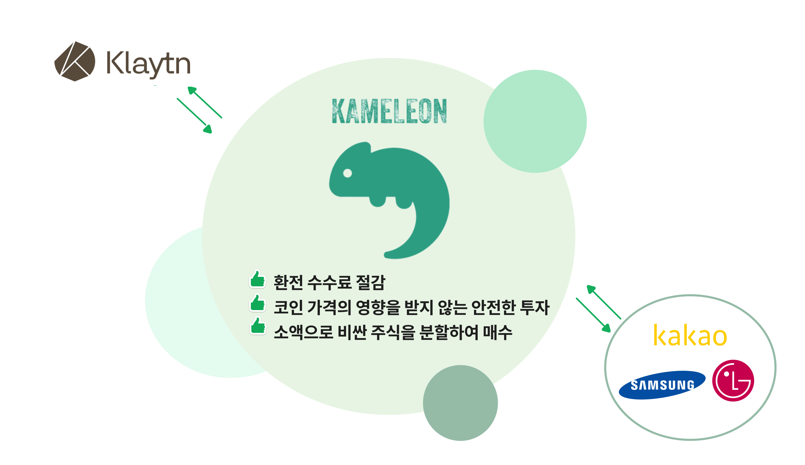

> **카멜레온**은 주식토큰을 발행하여 클레이튼 생태계와 증권 시장을 이어주는 스왑기반의 플랫폼입니다.

- 가상 자산 투자자 중에 **소액 투자자**들이 많습니다. **주식 시장에 있어서도 소수점 거래가 가능한 공인된 투자처를 제공**한다면 주식 시장 과 코인 시장 양쪽 거래량이 증가하여 양 시장 모두에게 이로운 결과를 제공할 수 있습니다.
- [금융 위원회](https://fsc.go.kr/no010101/77446)에서 국내 가상 자산 시장 현황 파악을 위해 신고된 29개 사업자에 대한 실태 조사에 따르면, 21년 12월 기준 **시가총액 55.2조, 일 평균 거래 규모 11.3조**에 이릅니다. 가상 자산 보유 규모는 **100만원 이하가 56%**로 많은 사람들이 소액으로 코인을 하는 것으로 조사되었습니다.
- 이러한 많은 사람들이 참여하는 자산 거래 시장에서 신뢰를 확보하기 위해 수많은 중개자가 필요하며 **시간과 비용의 소모 요인**입니다. 이를 블록체인 기반으로 토큰화하고 분산 플랫폼에서 활용한다면 많은 절차가 자동화되고 **시간과 비용이 절감**됩니다.

---

### 2. Concept

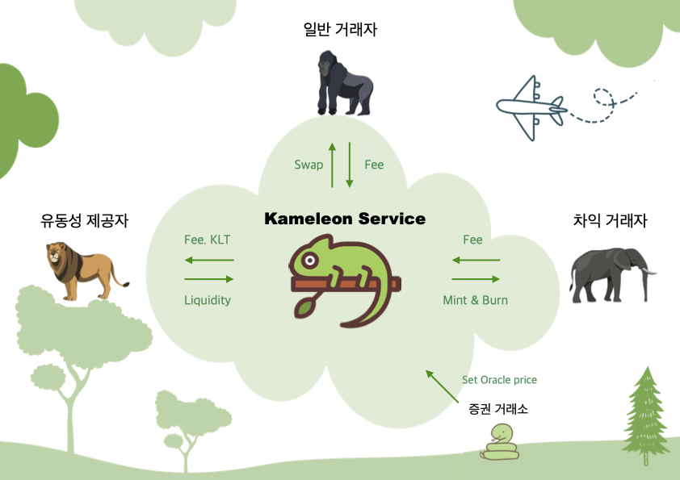

> #### 🍀  **Mint**

> 사용자가 원하는 수량의 클레이튼으로 해당 가격 만큼의 주식 토큰을 발행합니다.

> #### 🏊‍♂️ **Pool**
>
> 사용자가 보유한 주식 토큰과 클레이튼의 가치를 1:1로 설정한 후 풀에 예치합니다.
>
> #### 💫 **Swap**
>
> 사용자가 주식 토큰이나 클레이튼에서 주식 토큰을 교환하거나 주식 토큰에서 클레이튼으로 교환합니다.

---

### 3. Feature

**UI/UX**

- **KAIKAS 지갑 연동, 마이페이지**
  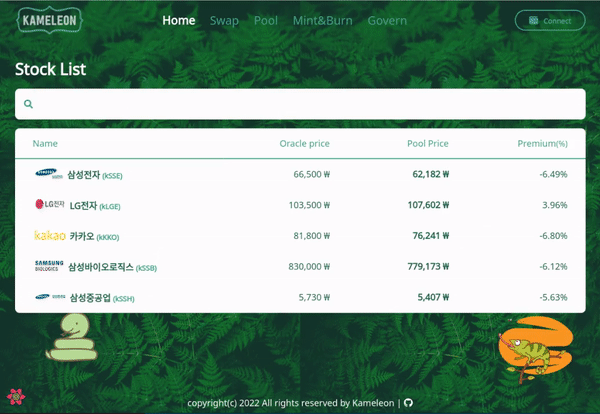

  - Redux를 사용하여 지갑 상태 관리를 합니다.
  - 마이페이지에서 보유중인 주식토큰들과 제공한 유동성 풀을 볼 수 있습니다.

 

- **Stock List 제공**
  

  - 각각의 주식 토큰의 실제 가격인 Oracle 가격과 풀 내의 가격을 제공하고 둘의 가격을 비교한 Premium 비율도 보여줍니다.
  - Premium 비율은 ‘현재 풀의 토큰 가격 / Oracle 가격’ 의 퍼센트 비율입니다.

 

- **반응형 UI**
  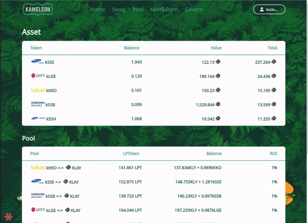

  - 760px을 기준으로 Mobile 과 PC 디스플레이에서 반응형 UI가 적용되도록 제작
  - Width와 Height를 제외하고는 rem 단위를 사용하여 제작
  - Header: Mobile 일때 Nav가 메뉴 클릭시 나타나도록 제작
  - List : Mobile 일때 필수 항목만 남기고 그외 column은 제거
  - 폰트사이즈 : Mobile 일때 폰트 사이즈 축소

 

**SWAP**

- **주식 토큰 클레이 스왑**
  

  - 제공된 주식 토큰과 KLAY 페어의 풀 내에서 서로 스왑할 수 있습니다. 또한 주식 토큰과 다른 주식 토큰과의 스왑도 가능합니다.
  - 스왑 가격은 수수료 0.3%를 제외하고 풀 내 KLAY와 주식 토큰의 곱이 일정하게 유지되는 CPMM(Constant Product Market Maker)으로 결정됩니다.
  - 최초에 한번 unlimited approve 를 요청해 transfer 권한을 받습니다.

 

**POOL**

- **주식 토큰 스왑풀 예치**
  

  - **스왑**은 무인 자판기와 같습니다. 거래하려는 대상이 동시에 존재하지 않더라도 스왑풀 내의 다른 화폐로 스왑을 할 수 있습니다. 그리고 이러한 스왑이 가능하게 하는 **유동성 제공자**들에게 보상을 지급합니다.
  - **스왑** 기능에 유동성을 제공하는 유동성풀을 예치할 수 있습니다. 유동성풀에 예치하기 위해선 KLAY와 주식토큰을 **동시에 예치**합니다. 스왑의 생태계에선 유동성 제공자들이 가장 중요합니다. 따라서 예치한 금액에 비례해 **LPT(Liquidity Provider Token)**을 발행받고 이를 통해 추가적인 보상을 제공받을 수 있습니다.
  - 유동성을 제공한 예치자들은 스왑을 이용한 유저들로부터 **LPT**지분만큼의 수수료를 받을 수 있고, 추가적으로 효율적인 유동성을 제공한 만큼 하루에 한번 **KLT(Kameleon Token)**를 지급받을 수 있습니다.
  - 이후 보유한 **LPT**를 다시 소각하여 지분만큼의 KLAY와 주식토큰을 돌려받을 수 있습니다.

 

- **유동성 제공자에게 KLT 제공**
  - 매일 서버에서 Exchange Contract의 LP token의 변화를 기준으로 5000개를 나누어 민팅 합니다. 반감기는 1년으로 제공되는 KLT의 양은 점점 줄어듭니다.
  - KLT는 Govern에 참여하기 위해 사용됩니다.

 

**MINT&BURN**

- Oracle 가격에 맞춰 주식 토큰 발행 및 소각
  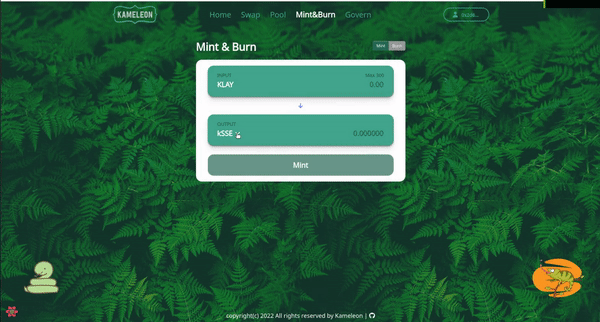
  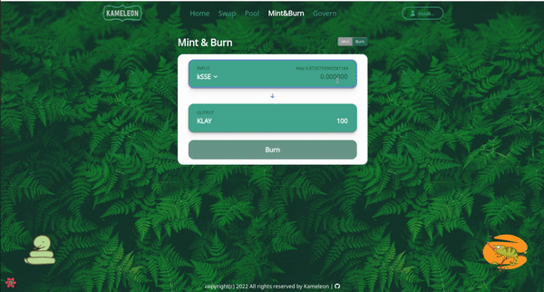
  - **Oracle**: 30초마다 주식API를 통해 노드 서버에서 가격 데이터를 받아 (주식 가격 / KLAY가격)의 결과 값을 Oracle Contract에 반영합니다. Oracle Contract는 입력 받은 비율을 기준으로 토큰의 발행과 소각에 필요한 KLAY가격을 결정합니다.
  - 1%의 수수료를 내고 Oracle 가격으로 주식 토큰을 상시 발행하거나 소각할 수 있습니다. 발행&소각 기능은 주식 토큰 가격을 실제 가격과 패깅하는 역할을 합니다.

 

**GOVERN**

- KLT를 통한 Govern 참여
  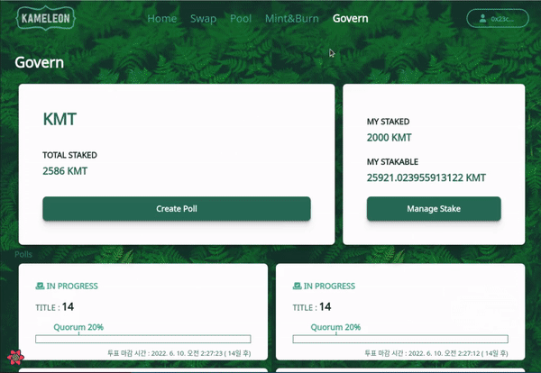
  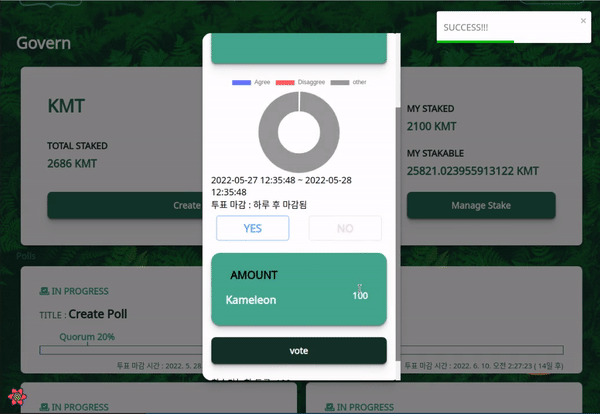

  - KLT 100개 당 하루를 기준으로 의제를 올릴 수 있습니다.
  - 최소 1~14일 까지 의제를 올릴 수 있습니다.
  - 의제 마감 전까지 투표가 가능하며 투표 마감 후 투표한 KLT 토큰을 회수할 수 있습니다.
  - 의제에 투표를 하면 마이페이지에서 투표한 목록을 볼 수 있습니다.

 

---

## 4. Tokenomics

- **kStockToken** : 주식토큰
  - **토큰명**
     Samsung Electronics, LG Electronics, Kakao Corp, Samsung Biologics Co Ltd, Samsung Heavy Industries
  - **티커명**
     kSSE, kLGE, kKKO, kSSB,kSSH
  - **컨트랙트 주소**
     kSSE - 0x58791638902535f1Cfc0004453B0A09bFC50B7bE,
     kLGE - 0x6727F8C740f5f3d3b58fc681fE32d3b9eC1D31Df,
     kKKO - 0x139B29164a11FD2AFBF772A761aC31B742C4C735,
     kSSB - 0x2DE466829ac31Db937946365A9f8Aec86363120F,
     kSSH - 0xE90E363fD3FfdB1Aa8577c71EbBABd00d8c7aBea
  - **체인**: 클레이튼
- **KameleonToken** : Govern 참여 토큰
  - **토큰명** : Kameleon
  - **티커명** : KLT
  - **컨트랙트 주소** : 0x48b19619273A96FFf8735a60D9A19924a5016E39
  - **체인** : 클레이튼
  - **하루 발행량**: 5000, 반감기 1년

<h3 align="center">🛠 Tech Stack 🛠</h3>

<h4 align="center">Planning & Cooperation</h4>

  </a>&nbsp 
  </a>&nbsp 
  </a>&nbsp 
  </a>&nbsp 
  </a>&nbsp 

<h4 align="center">Frontend</h4>

  </a>&nbsp 
  </a>&nbsp 
  </a>&nbsp 
  </a>&nbsp 

<h4 align="center">Backend</h4>

  </a>&nbsp 
  </a>&nbsp
  </a>&nbsp 
  </a>&nbsp 

<h4 align="center">Contract</h4>

  </a>&nbsp 
  </a>&nbsp 
  </a>&nbsp 
</a>&nbsp 

### 🔗 [Mock Design](https://www.figma.com/file/25M4bMybMBN3HawiXaiy9h/kameleon?node-id=0%3A1)

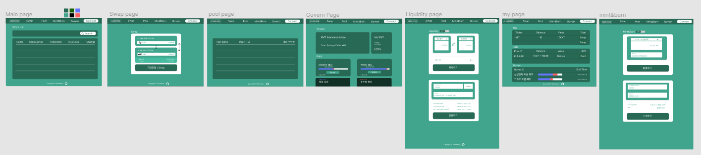

### 🔗 [User Flow](https://www.figma.com/file/y5COtaLzfsoL1TVzSkbBxY/Kameleon?node-id=0%3A1)

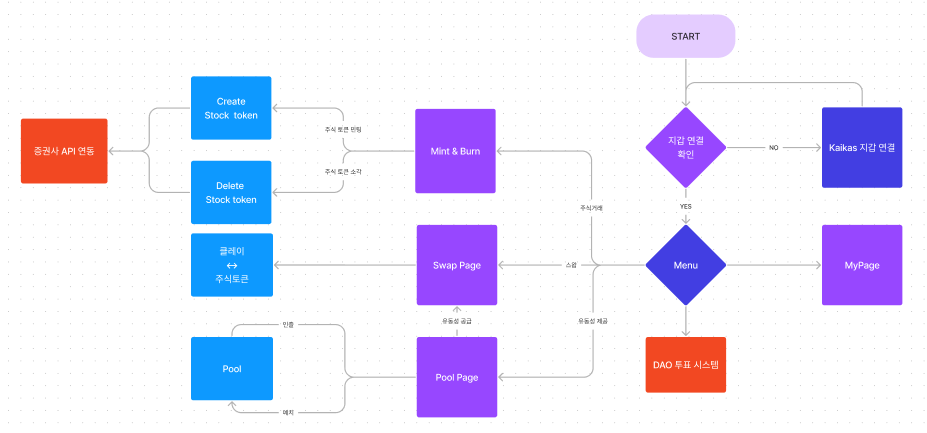

### 🔗 [Smart Contract Model](https://www.figma.com/file/i08cRGyRDOzuRyzGqQxCvO/Kameleon-v2.3?node-id=0%3A1)

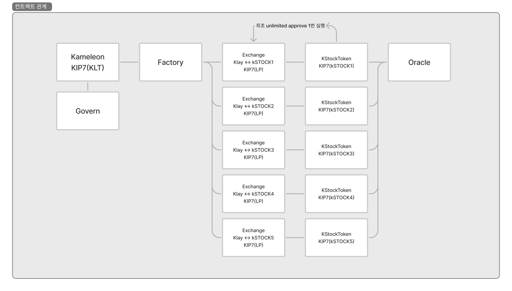

컨트랙트 관계도

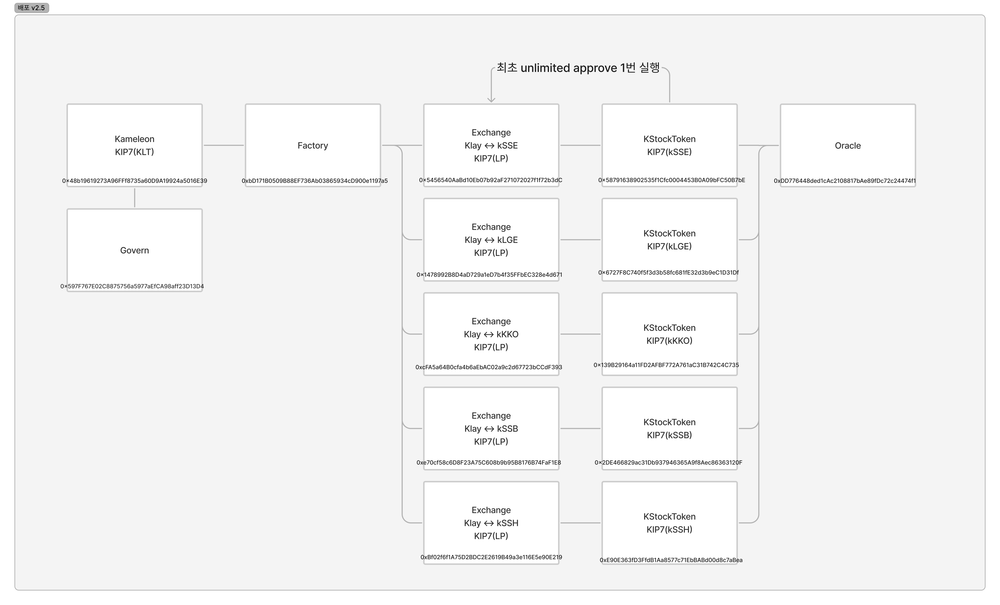

배포된 컨트랙트

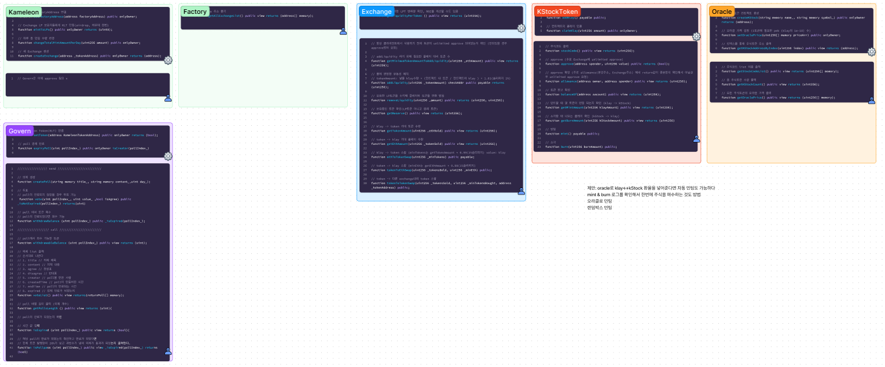

컨트랙트별 주요 함수
